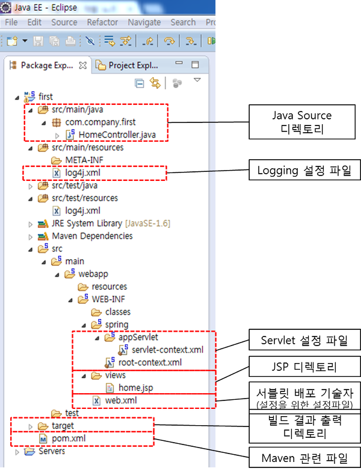

# 2019.06.27 Init

[링크!](https://doublesprogramming.tistory.com/category/%EC%8A%A4%ED%94%84%EB%A7%81%20%ED%94%84%EB%A0%88%EC%9E%84%EC%9B%8C%ED%81%AC)

## 스프링의 주요 특징

### Spring Framework란?
> "자바 엔터프라이즈 개발을 편하게 해주는 오픈소스 경량급 애플리케이션 프레임워크"  

### POJO(Plain Old Java Object) 기반의 구성

##### POJO란?
오래된 방식의 간단한 자바 오브젝트라는 말로서 객체지향적인 원리에 충실하면서, 환경과 기술에 종속되지 않고 필요에 따라 재활용될 수 있는 방식으로 설계된 오브젝트를 의미한다. 즉, 별도의 API가 필요하지 않은 일반적인 자바 코드를 이용하여 개발이 가능하다.

POJO의 조건
- 특정규약에 종속되지 않는다.
- 특정환경에 종속되지 않는다.

### DI(의존성 주입)을 통한 객체간의 관계구성
- 객체 간의 의존성을 개발자가 설정하는 것이 아닌 스프링 컨테이너가 주입시켜주는 기능
- 객체를 쉽게 확장하고 재사용할 수 있음

### AOP(Aspect Oriented Programming, 관점지향 프로그래밍) 지원
- 반복적인 코드를 줄이고, 개발자가 비지니스 로직에만 집중할 수 있도록 지원한다.
- 핵심로직이 중요하지, 부수적인 코드가 중요한 것이 아니다!
- 스프링은 반드시 처리가 필요한 부분을 '횡단 관심사'라고 하며, 이러한 횡단관심사를 분리해 제작하는 것이 가능

### 편리한 MVC 구조
* WAS에 종속적이지 않은 개발환경 
* IoC(Inversion of Control, 제어의 역전) = 객체에 대한 제어권
  - 기존에는 개발자에게 제어권이 있었다. (new 연산자로 객체생성)
  - 객체의 제어권을 스프링에게 넘김(개발자에게 편리함을 제공, 코드의 최소화)
  - 인스턴스의 라이프 사이클(생성->소멸)을 개발자가 아닌 스프링 컨테이너가 담당
* 트랜잭션(Transaction)의 지원
  - 복잡한 트랜잭션관리를 애노테이션이나 XML로 설정할 수 있기 때문에 개발자가 매번 상황에 맞는 코드를 작성할 수 없게 설계

  ---

  ## 스프링 프로젝트의 구조

src/main/java : 자바코드(컨트롤러, 모델)  
src/main/resources : 자바 코드에서 사용할 리소스(mapper, sql)  
src/test/java : 테스트 코  
src/test/resources : 테스트 코드에서 사용할 리소스  
Maven Dependencies : 라이브러리 관리도구(maven에서 다운받은 jar파일)  
src : web디렉토리  
src/main/webapp/resources : js, css, image 등등을 관리  
src/main/webapp/WEB-INF/classes : 컴파일된 클래스  
src/main/webapp/WEB-INF/spring : 스프링 환경설정파일(root-context.xml, servlet-context.xml)  
src/main/webapp/WEB-INF/views : html, jsp파일  
src/main/webapp/ : 외부접근 가능  
src/main/webapp/WEB-INF : 외부접근 불가, 컨트롤러를 경유해서 접근 가능  

#### WEB-INF폴더
외부에서 직접 접속이 차단되어있다. 그 이유는 컴파일된 클래스와 스프링 환경설정파일(DB연결정보)이 존재하기 때문
JSP 또한 외부로 접속하여 수정되는 것을 방지하기 위한 보안 때문에 외부접근이 금지되어있기 때문 

#### pom.xml
maven에서 참조하는 설정파일
maven은 빌드와 관련된 정보를 프로젝트 객체모델(Project Object Model)이라는 이름으로 정의하고 사용하는데 pom이라는 이름으로된 pom.xml파일을 사용한다.

- 참조
[링크1](https://addio3305.tistory.com/37?category=772645) ,[링크2](https://all-record.tistory.com/164?category=733072) ,[링크3](http://linux.systemv.pe.kr/%EC%8A%A4%ED%94%84%EB%A7%81-%EB%94%94%EB%A0%89%ED%86%A0%EB%A6%AC-%EA%B5%AC%EC%A1%B0-%EC%9E%AC%EC%A0%95%EC%9D%98%ED%95%98%EA%B8%B0/) ,[링크4](http://lazyrodi.github.io/2017/09/03/2017-09-03-spring-structure/) ,[링크5](https://jayviii.tistory.com/15?category=996149)

---

# 추후 정리 일단 소스주석... 설명..
